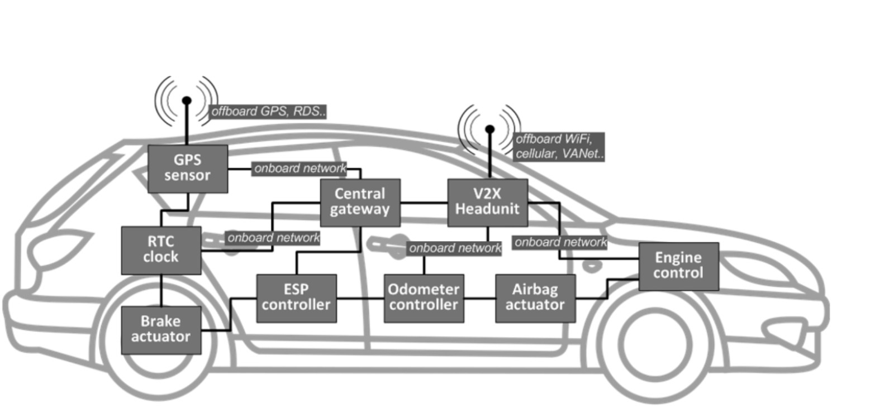

# Car Controller Area Network (CAN) Security

This repository addresses the challenges associated with securing the Controller Area Network (CAN) communication in modern automobiles. As vehicles become more integrated and connected, ensuring the integrity and safety of data transmitted over the CAN bus is crucial.

## Introduction

The figure illustrates the complex network of Electronic Control Units (ECUs) in a vehicle. The Engine Control Unit communicates with various controllers like the odometer and brakes via the CAN bus. While CAN enables efficient communication, it also introduces cybersecurity vulnerabilities. Intelligent Transportation Systems (ITS) applications, while enhancing driver experiences and road safety, can potentially be exploited by attackers.

## Challenges and Solutions

- **Increased Connectivity:** Modern vehicles communicate with external entities, making them susceptible to cyber-attacks.
- **Preventive Solutions:** Modifying the CAN protocol is challenging for existing vehicles.
- **Detection-Based Solutions (IDS):** Intrusion Detection Systems are crucial for identifying malicious activities within the CAN network.

## Our Approach

- **Behavioral Analysis:** Implementing advanced IDS techniques for real-time CAN bus behavioral analysis.
- **Collaboration:** Working collaboratively with experts and manufacturers to establish industry-wide standards.
- **Regular Updates:** Ensuring software and firmware are regularly updated to patch known vulnerabilities.
